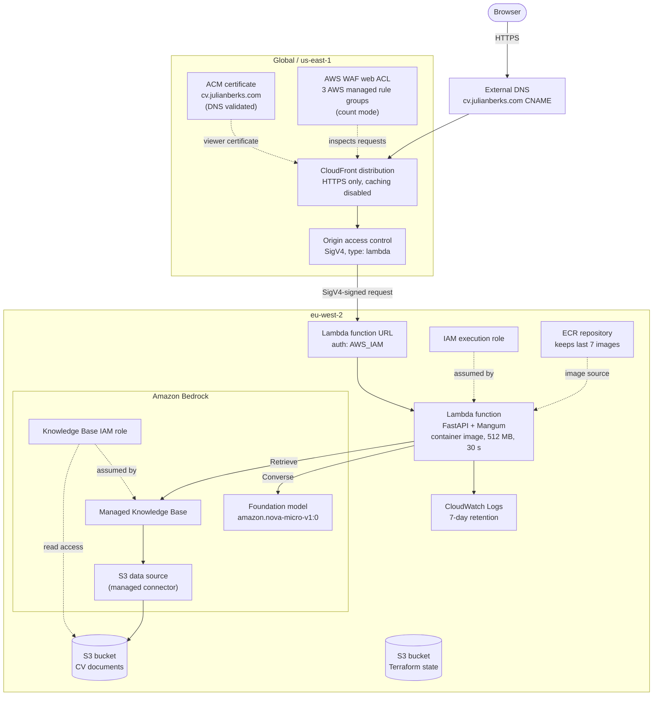
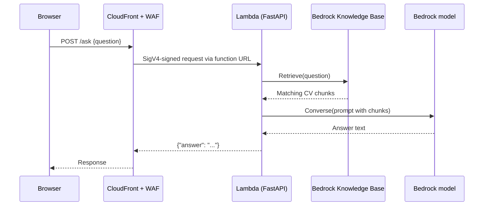
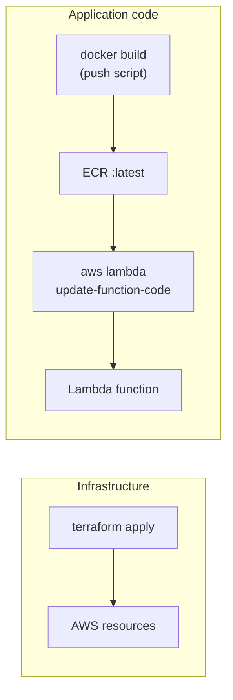

# CV App Architecture

A chat page that answers questions about Julian's CV. A FastAPI app runs as a container image on AWS Lambda, behind CloudFront. Answers are generated by Amazon Bedrock from a Knowledge Base built over CV documents in S3.

For running and deploying the app, see the [README](../README.md).

## AWS architecture



## Request flow

1. The browser requests `https://cv.julianberks.com/`. External DNS resolves the name to the CloudFront distribution.
2. The WAF web ACL evaluates the request. Its managed rule groups are in count mode, so they record matches but don't block.
3. CloudFront terminates TLS using the ACM certificate and forwards the request to the Lambda function URL. Caching is disabled, so every request reaches Lambda.
4. CloudFront signs the origin request with SigV4 through the origin access control. The function URL uses `AWS_IAM` authorization, and a Lambda resource policy allows only this distribution to invoke it. Direct calls to the function URL are rejected.
5. Mangum adapts the Lambda event to ASGI and FastAPI handles it:
   - `GET /` returns `static/index.html`, which loads Vue 3 from a CDN and `static/app.js`.
   - `POST /ask` runs the question through Bedrock and returns `{"answer": "..."}`.
6. For `/ask`, `answer_question()` in [app.py](../app.py):
   1. Calls `bedrock-agent-runtime` `Retrieve` on the Knowledge Base with the question.
   2. Joins the returned text chunks into a context block.
   3. Calls `bedrock-runtime` `Converse` with a prompt that asks the model to answer using only that context.
7. The answer is returned to the browser and shown in the chat. Each question is independent; no conversation history is sent to the model.



## Components

| Component | Purpose | Defined in |
| --- | --- | --- |
| ACM certificate | TLS certificate for the domain, created in `us-east-1` (required by CloudFront) and validated with a DNS record you create externally | [cloudfront.tf](../terraform/app/cloudfront.tf) |
| CloudFront distribution | Public HTTPS entry point for the custom domain; uses the managed `CachingDisabled` cache policy and `AllViewerExceptHostHeader` origin request policy | [cloudfront.tf](../terraform/app/cloudfront.tf) |
| CloudFront origin access control | Signs requests to the Lambda function URL with SigV4 | [cloudfront.tf](../terraform/app/cloudfront.tf) |
| WAF web ACL | Required by the CloudFront pricing plan; runs the IP reputation, common, and known-bad-inputs AWS managed rule groups in count mode | [cloudfront.tf](../terraform/app/cloudfront.tf) |
| Lambda permissions | Allow `cloudfront.amazonaws.com` to invoke the function URL, limited to this distribution | [cloudfront.tf](../terraform/app/cloudfront.tf) |
| Lambda function | Runs the container image; environment variables `KNOWLEDGE_BASE_ID` and `MODEL_ID` | [modules/lambda](../terraform/modules/lambda/main.tf) |
| Lambda function URL | HTTPS endpoint for the function, with `AWS_IAM` authorization | [modules/lambda](../terraform/modules/lambda/main.tf) |
| IAM execution role | Basic Lambda logging plus `bedrock:Retrieve` and `bedrock:InvokeModel` on the Knowledge Base and model | [modules/lambda](../terraform/modules/lambda/main.tf) |
| CloudWatch log group | Function logs, 7-day retention | [modules/lambda](../terraform/modules/lambda/main.tf) |
| ECR repository | Stores the Lambda container images; scan on push; lifecycle policy keeps the latest 7 | [modules/ecr](../terraform/modules/ecr/main.tf) |
| Bedrock Knowledge Base | Managed Knowledge Base used for retrieval | [modules/knowledge-base](../terraform/modules/knowledge-base/main.tf) |
| Bedrock data source | Managed S3 connector that ingests the CV documents with smart parsing | [modules/knowledge-base](../terraform/modules/knowledge-base/main.tf) |
| Knowledge Base IAM role | Assumed by Bedrock; read access to the RAG bucket, scoped to this account | [modules/knowledge-base](../terraform/modules/knowledge-base/main.tf) |
| S3 RAG bucket | Holds the CV documents. Referenced by name; not created by this Terraform | [main.tf](../terraform/app/main.tf) |
| S3 state bucket | Terraform remote state with lockfile locking and encryption. Referenced by name; not created by this Terraform | [backend.tf](../terraform/app/backend.tf) |

## Application code

| File | Role |
| --- | --- |
| [app.py](../app.py) | FastAPI routes, Bedrock calls, and the Lambda handler (`Mangum`) |
| [static/index.html](../static/index.html) | Chat page layout and styles |
| [static/app.js](../static/app.js) | Vue 3 app; posts to the relative path `ask` and renders replies and errors |
| [Dockerfile](../Dockerfile) | Builds on `public.ecr.aws/lambda/python:3.12`; entry point `app.handler` |
| [push](../push) | Builds a `linux/amd64` image and pushes `latest` to ECR |

`/ask` validates the question (1 to 1000 characters after trimming) and returns `422` for invalid input or `502` if a Bedrock call fails. The `/s3` route asks a fixed question about S3 experience and is useful as a smoke test.

## Terraform layout

```text
terraform/
  app/                    Root module (state: S3 backend, eu-west-2)
    main.tf               ECR, Lambda, and Knowledge Base module wiring
    cloudfront.tf         ACM, CloudFront, WAF, OAC, Lambda permissions
    variables.tf          name, region, domain_name, model_id, container_deployed, tags
    outputs.tf            ACM validation records, CloudFront domain name
  modules/
    ecr/                  Container image repository
    lambda/               Container-image Lambda, role, logs, function URL
    knowledge-base/       Bedrock Knowledge Base, S3 data source, IAM role
    ecr-dummy-image/      Seeds a placeholder image (currently unused)
```

The `container_deployed` variable gates the Lambda, ACM certificate, and CloudFront resources, so the ECR repository can be created and an image pushed before the rest. The `aws.us_east_1` provider alias is used for ACM and WAF, which CloudFront requires in `us-east-1`.

## Deployment

Infrastructure and application code are deployed separately.



1. **First apply.** Create the ECR repository, push an image, then apply with `container_deployed = true` to create the Lambda, certificate, and distribution.
2. **Certificate validation.** Apply creates the ACM certificate, which stays pending until you add the validation CNAME from the `acm_dns_validation_records` output to your DNS provider.
3. **DNS.** Point `cv.julianberks.com` at the `cloudfront_domain_name` output.
4. **Code releases.** Run the `push` script, then `aws lambda update-function-code` with the new image. Terraform ignores changes to `image_uri`, so code releases never cause Terraform drift.

## Security notes

- The function URL is not publicly invokable. Only the CloudFront distribution can call it, through OAC-signed requests.
- The Lambda role grants Bedrock access only to the specific model and Knowledge Base.
- The Knowledge Base role can be assumed only by Bedrock from this account, for knowledge bases in `eu-west-2`.
- WAF rule groups run in count mode, so they report but don't block requests.
- `/ask` is unauthenticated and each call invokes a Bedrock model, so request volume drives cost.


## Further enhancements
- The compilation of the docker container and deployment is not integrated into the automation. 
- When a new container is deployed, updating the Lambda to reflect the change is a manual task.
- The sync of the Bedrock Knowledge base is manual and does not respond to a new CV or other files being added.
- Deployment of the CV data file is outside the scope of this project.
- There is no CI-CD pipeline 
